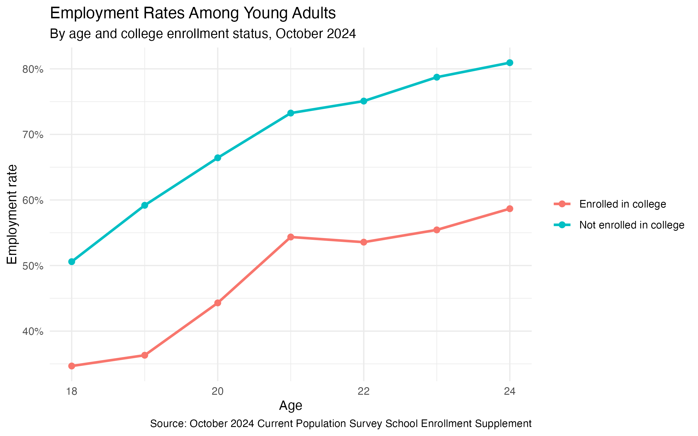

# College Enrollment and Employment Among Young Adults

This independent research project examines how college enrollment is associated with employment and work hours among young adults in the United States.

I use the October 2024 Current Population Survey (CPS) School Enrollment Supplement and focus on adults ages 18–24, comparing those currently enrolled in college with those who are not enrolled.

## Research Question

How do employment and work hours differ between college-enrolled and non-enrolled young adults?

## Data
The raw CPS file is not included in this repository. The October 2024 CPS School Enrollment Supplement can be downloaded from the U.S. Census Bureau.

**Source:** U.S. Census Bureau, October 2024 Current Population Survey (CPS) School Enrollment Supplement

- Adults ages 18–24
- 7,319 observations in the main employment sample
- Current high school students excluded from the main analysis
- CPS person weights used throughout the analysis
- Main outcomes: employment status and usual weekly hours worked

Employment is defined using CPS labor force status. College enrollment is based on current school enrollment and school level.

## Methods

- Weighted descriptive statistics
- Employment rates by age and college enrollment
- Weighted linear probability models for employment
- Weighted OLS models for usual weekly hours
- Age and demographic controls
- Heteroskedasticity-robust standard errors

The hours analysis is limited to employed respondents with valid information on usual weekly hours at their main job.

## Main Results

The raw weighted regression shows that college-enrolled young adults have an employment rate about **26.2 percentage points lower** than young adults who are not enrolled in college.

Part of this difference is related to age. After controlling for age and basic demographic characteristics, the estimated difference is about **20.5 percentage points**.

I also find a large difference in work hours among those who are employed. College-enrolled young adults work an average of **23.5 hours per week**, compared with **37.1 hours per week** among those who are not enrolled. After adding age and demographic controls, the estimated difference is about **11.7 hours per week**.

These estimates describe differences between the two groups and should not be interpreted as causal effects of college enrollment.

## Figures

### Employment Rates by Age

The figure compares weighted employment rates for college-enrolled and non-enrolled young adults between ages 18 and 24.

## Project Structure

    R/
        01_clean.R
        02_descriptives.R
        03_figures.R
        04_analysis.R

    data/
        clean/
            cps_young_adults_2024.csv

    output/
        figures/
            employment_by_age.png
        tables/
            regression_table.html
            hours_regression_table.html
            
## Software

- R
- tidyverse
- fixest
- modelsummary

## Notes

This is an independent research project. The analysis is intended as an applied exercise in working with individual-level survey data, CPS weights, data cleaning, visualization, and regression analysis.

Because the data is cross-sectional, the results are treated as descriptive relationships rather than causal estimates.
